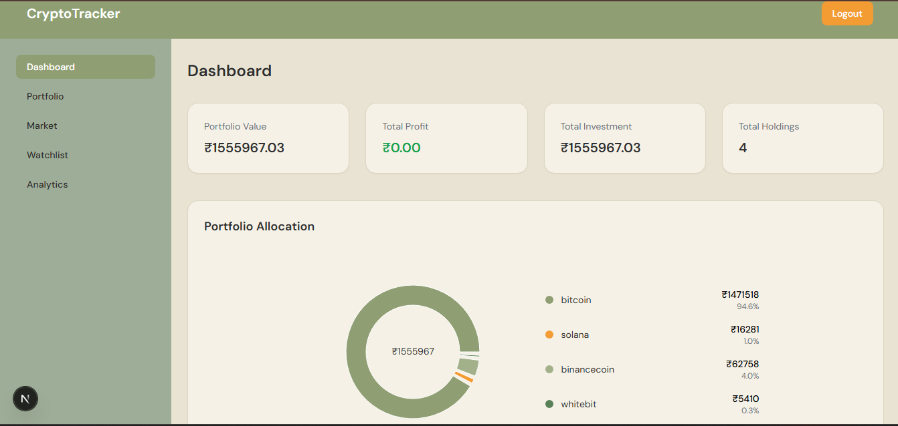
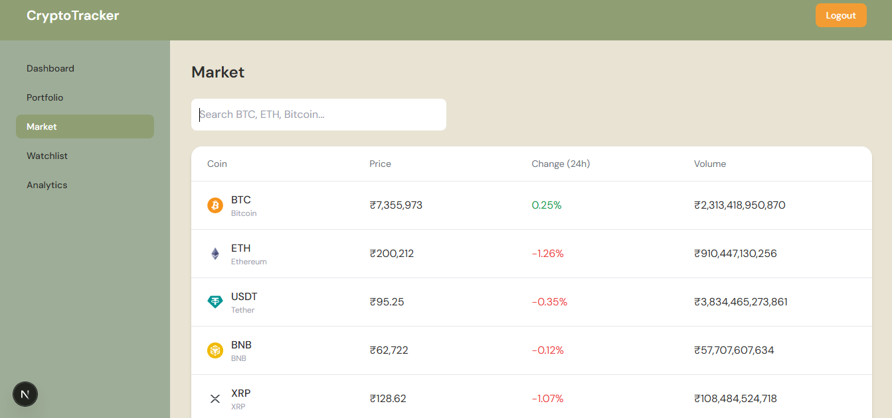
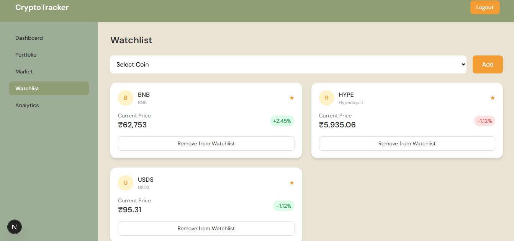
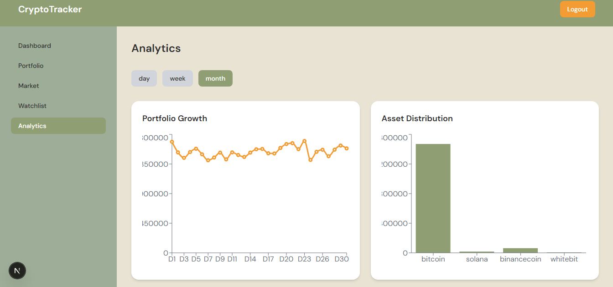

# CryptoTracker — Modern Crypto Portfolio Dashboard

A modern, full-stack **crypto portfolio tracking web application** built with **Next.js, TypeScript, and Tailwind CSS**.  
This app allows users to track investments, analyze portfolio performance, and explore live crypto market data — all through a clean and intuitive UI.

---

## Features

### Portfolio Management
- Add and manage crypto assets
- Track **total investment vs current value**
- Calculate **real-time profit/loss**
- Maintain a structured portfolio view

---

### Analytics Dashboard
- Interactive charts using **Recharts**
- Portfolio growth visualization
- Asset allocation (donut chart)
- Percentage distribution of holdings

---

### Market Explorer
- Live crypto data using **CoinGecko API**
- Search by **coin name or symbol**
- View:
  - Price
  - 24h change
  - Volume

---

### Watchlist
- Add coins to personal watchlist
- Prevent duplicate entries
- Fetch real-time prices
- Error handling for API limits

---

### Authentication (Frontend)
- Login & Register system using **localStorage**
- Input validation:
  - Email format
  - Password length
- Protected routes using client-side checks

---

### Modern UI/UX
- Glassmorphism design (blur + transparency)
- Full-screen background with overlay
- Responsive layout (mobile + desktop)
- Smooth hover & interaction effects
- Clean color system (dark + beige contrast)

---

## Crypto Knowledge Applied

This project reflects practical understanding of:

-  **Crypto market structure**
  - Coins, symbols, pricing, and volume
-  **Portfolio valuation**
  - `Total Value = Σ(quantity × current price)`
-  **Profit/Loss calculation**
  - `P/L = Current Value - Investment`
-  **Market data integration**
  - Real-time price fetching via APIs
-  **Asset allocation analysis**
  - Distribution across multiple cryptocurrencies

---

## Tech Stack

| Category        | Technology |
|----------------|-----------|
| Frontend       | Next.js (App Router) |
| Language       | TypeScript |
| Styling        | Tailwind CSS |
| Charts         | Recharts |
| API            | CoinGecko API |
| State Mgmt     | React Context API |
| Storage        | LocalStorage |

---

## Architecture Highlights

-  **Context API for Market Data**
  - Global state with caching
  - Prevents unnecessary API calls

-  **Client-side caching**
  - Reduces API rate limit issues

-  **Component-based design**
  - Reusable UI components

-  **Separation of concerns**
  - Pages vs Components vs Context

---

## 📸 Screenshots

### 🏠 Home Page


### 📊 Dashboard


### 📈 Market Page


### ⭐ Watchlist


### 📉 Analytics


---

## Getting Started

### 1. Clone the repo
```bash
git clone https://github.com/your-username/crypto-tracker.git
cd crypto-tracker
```

### 2. Install dependencies
```bash
npm install
```

### 3. Run the app
```bash
npm run dev
```

---

## Future Improvements

-  Backend authentication (JWT / OAuth)
-  WebSocket for real-time price updates
-  Mobile optimization
-  Dark/Light theme toggle
-  Cloud database integration (MongoDB / Firebase)

---

## Why This Project Matters

This project demonstrates:

- Strong **frontend development skills**
- Ability to work with **real-world APIs**
- Understanding of **financial data handling**
- Clean **UI/UX design sense**
- Scalable **state management**

---

## Author

**Aishwarya M**  
Aspiring Software Developer | Interested in Web Development & Data-Driven Applications  

---

## ⭐ If you like this project

Give it a ⭐ on GitHub!
